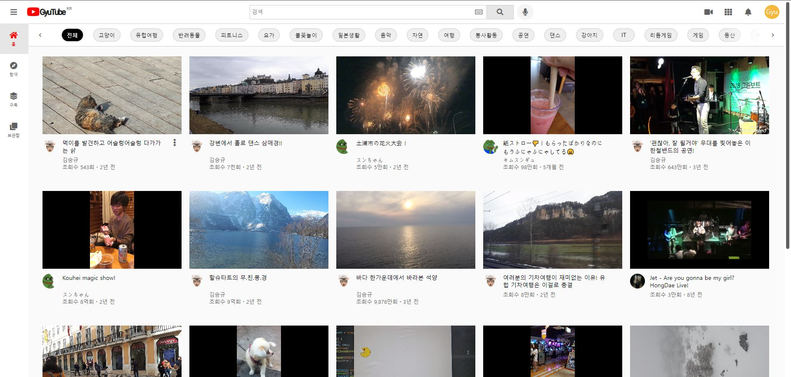
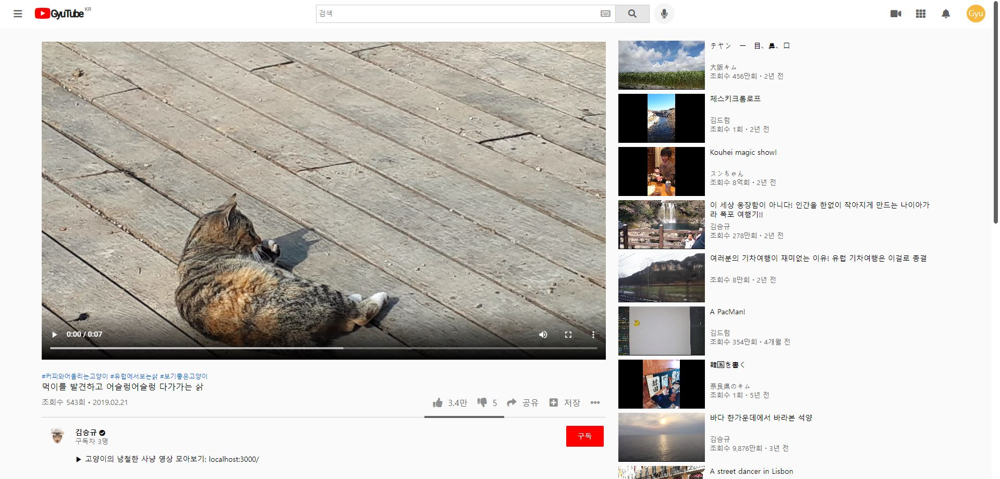
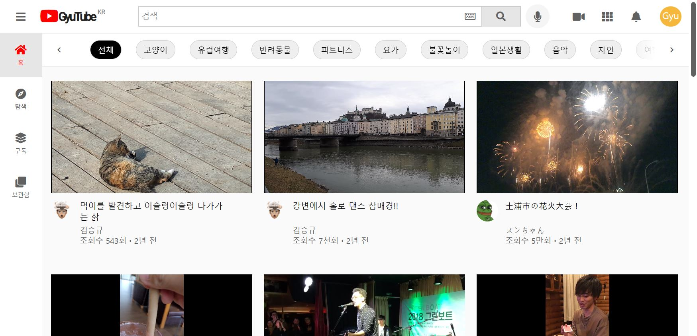
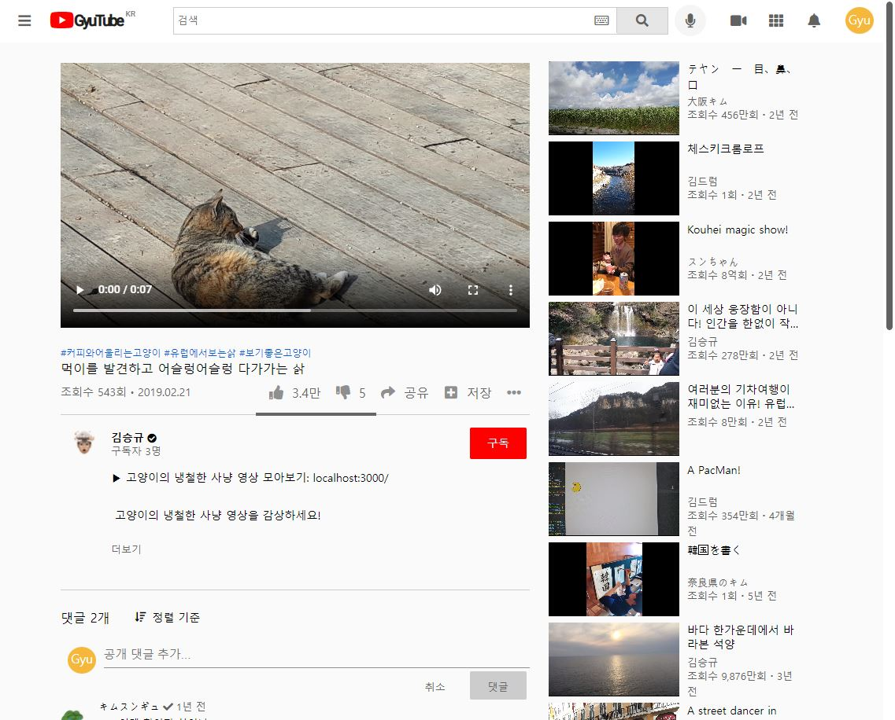
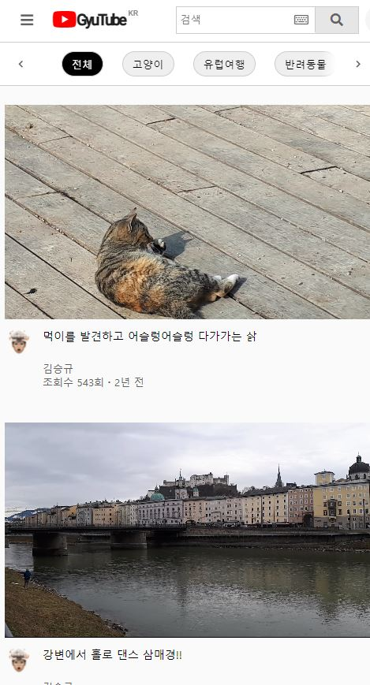
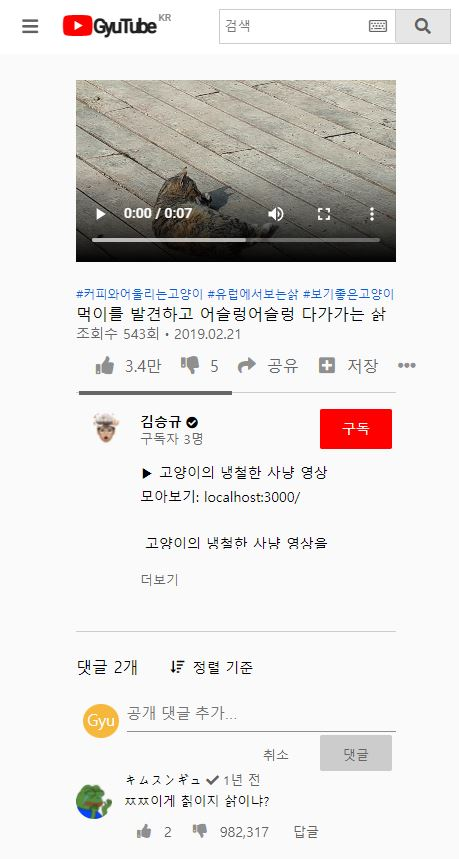

# GyuTube

## 1. 프로젝트 개요

### 개요

- 유튜브 동영상 플레이어 페이지 클론 코딩 개인 프로젝트 "GyuTube"입니다.

  https://kimsg64.github.io/GyuTube/

> 

### 목표

- REST API 서버에서 데이터를 받아왔다는 전제 하에 유튜브 메인 페이지 및 동영상 페이지 화면 구현하기
- React.js의 숙련도 향상하기
- 웹 페이지의 디자인 시안에 맞추어 뷰 페이지 제작하기

### 기간

- 2021.08.03 ~ 2021.09.04

### 프로젝트를 통해 배운 것

- HTML, CSS의 다양한 속성들을 공부하고 활용할 수 있게 되었습니다.
- Javascript의 이벤트 개념에 익숙해졌습니다.
- React.js의 함수형 컴포넌트를 통해 OOP의 강력한 기능인 재사용성을 직접 체험해보고, 활용할 수 있게 되었습니다.
- styled-components를 접하고 CSS in JS 방식으로 뷰 페이지를 구성할 수 있게 되었습니다.

## 2. 기술 스택

- React.js
  > 프로젝트 목표에 맞게 React.js를 이용해 뷰 페이지를 제작했습니다.
- styled-components
  > 컴포넌트 관리 효율성의 향상을 위해 이용하였으며, CSS in JS 방식에 익숙해졌습니다.
- react-router
  > 각 페이지를 개별적으로 관리하기 위해 이용했습니다.

## 3. 구현 기능

### 반응형 웹

- pc(1024px ~)

  > 

  > 

- tablet(801 ~ 1023px)

  > 

  > 

- mobile(~800px)

  > 

  > 

### 헤더

- 메뉴 버튼 및 로고: 메뉴 버튼에는 메뉴 가이드바 토글 버튼, 로고에는 홈으로 이동하는 기능을 구현했습니다.
  > 
- 검색어 자동 완성 및 검색: 간단한 정규표현식을 이용하여 검색어 자동 완성 기능을 구현하였습니다. 검색 차엥 입력한 글자가 포함된 제목을 찾아 리스트를 보여 주며, 검색을 실행하면 해당 동영상만 필터링되어 표시됩니다.
- 가상 키보드: 검색어 입력 파트 내부의 키보드 아이콘을 클릭하여 가상 키보드를 이용할 수 있습니다.
- 음성 인식: react-speech-kit 라이브러리를 이용하여 음성 인식 기능을 구현하였습니다.

### 필터링

### 음성 인식

### 가상 키보드
