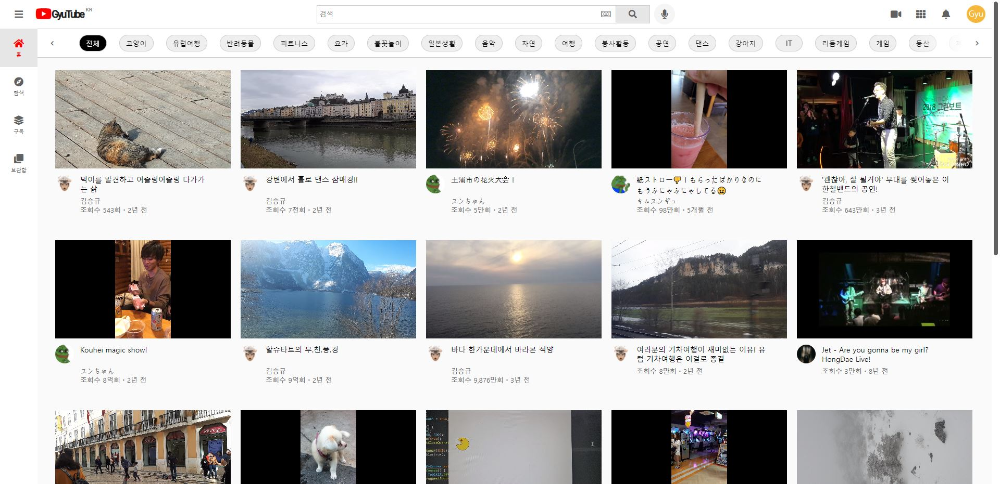

# GyuTube

https://kimsg64.github.io/GyuTube/

> 유튜브 동영상 플레이어 페이지 클론 코딩 개인 프로젝트 "GyuTube"입니다.
> 

## 1. 프로젝트 개요

### 개요

- 유튜브

### 목표

- REST API 서버에서 데이터를 받아왔다는 전제 하에 유튜브 메인 페이지 및 동영상 페이지 화면 구현
- React.js의 숙련도 향상
- 웹 페이지의 디자인 시안에 맞추어 뷰 페이지 제작

### 기간

- 2021.08.03 ~ 2021.09.04

### 프로젝트를 통해 배운 것

- HTML, CSS의 다양한 속성들을 공부하고, 활용할 수 있게 되었습니다.
- Javascript의 이벤트 관련 개념들에 대해 익숙해졌습니다.
- React.js의 함수형 컴포넌트를 통해 OOP의 강력한 기능인 재사용성을 직접 체험해보고, 활용할 수 있게 되었습니다.
- styled-components를 접하고 CSS in JS 방식으로 뷰 페이지를 구성할 수 있게 되었습니다.

## 2. 기술 스택

- React.js
  > 프로젝트 목표에 맞게 React.js를 이용해 뷰 페이지를 제작했습니다.
- styled-components
  > 컴포넌트 관리 효율성의 향상을 위해 이용하였으며, CSS in JS 방식에 익숙해졌습니다.
- react-router
  > 각 페이지를 개별적으로 관리하기 위해 이용했습니다.

## 3. 구현 기능

-
